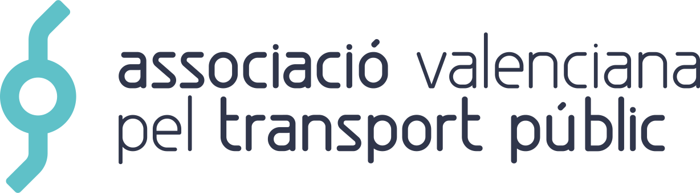

<p align="center"><a href="https://avptp.org"></a></p>

# Face

## About

Face is the main web application of [Associació Valenciana pel Transport Públic](https://avptp.org) (Valencian Association for Public Transport), a non-profit organization whose goal is to achieve the public transport that the [Valencian society](https://en.wikipedia.org/wiki/Valencian_Community) deserves.

It is made with [Next.js](https://nextjs.org) —a [React](https://reactjs.org) framework— and love. ❤

### Directory structure

The project follows the default Next.js application structure with the following additions:

- `deployments`, `.dockerignore`, `.env.example`, `docker-compose.yml` and `Dockerfile` contain the configuration and manifests that define the development and runtime environments with [Docker](https://www.docker.com), [Docker Compose](https://docs.docker.com/compose), [Kubernetes](https://kubernetes.io) and [Helm](https://helm.sh).
- `.github` holds the [GitHub Actions](https://github.com/features/actions) CI/CD pipelines.

### License

This software is distributed under the MIT license. Please read [the software license](license.md) and [the graphic resources license](src/images/license.md) for more information on the availability and distribution.

## Getting started

This project comes with a virtualized environment that has everything necessary to develop on any platform.

**TL;TR**

```Shell
./install
task
```

### Requirements

Before starting using the project, make sure that the following software is installed on your machine:

- [Taskfile](https://taskfile.dev/#/installation), a task runner that makes the project much easier to use.
- [Docker](https://docs.docker.com/engine/install), a virtualization software that allows to create lightweight virtual environments.
- [Docker Compose](https://docs.docker.com/compose/install/), a tool for defining and running multi-container Docker applications.

It is necessary to install the latest versions before continuing. You may follow the previous links to read the installation instructions or simply run the following command.

```Shell
./install
```

### Initializing

First, initialize the project and run the environment.

```Shell
task
```

You can stop the environment by running the following command.

```Shell
task down
```

Finally, install NPM dependencies.

```Shell
task run -- npm ci
```

## Usage

You can run commands inside the virtual environment by prefixing them with a shortcut command (`task run -- <command>`) or by running a shell in the container (`task shell`).

### Running the development server

Run the following command to start the development server:

```Shell
task run -- npm run dev
```

> Note that Git is not available in the container, so you should use it from the host machine. It is strongly recommended to use a desktop client like [Fork](https://git-fork.com) or [GitKraken](https://www.gitkraken.com).

## Deployment

The deployment process is automated with [GitHub Actions](https://github.com/features/actions) and [Kubernetes](https://kubernetes.io). When changes are incorporated into production (`master` branch) or staging (`develop` branch), an automatic deployment is made to the corresponding environment.

## Troubleshooting

There are several common problems that can be easily solved. Here are their causes and solutions.

### Docker

The Docker environment should work properly. Otherwise, it is possible to rebuild it by running the following command.

```Shell
task rebuild
```

To start from scratch, you can remove all containers, images and volumes of your computer by running the following commands.

> Note that all system containers, images and volumes will be deleted, not only those related to this project.

```Shell
docker compose down
docker rm $(docker ps -a -q)
docker rmi $(docker images -q)
docker volume rm $(docker volume ls -f dangling=true -q)
```
